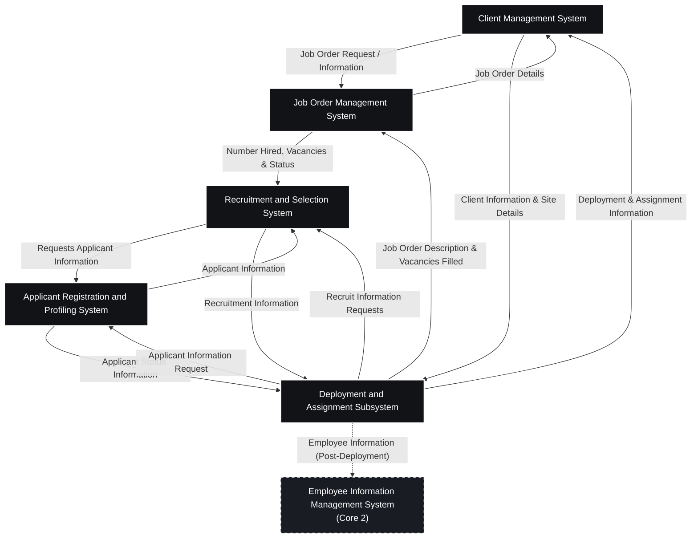

# ISMERS — Business Process Architecture (BPA) Diagram

## Core Transaction 1: Client Acquisition, Recruitment, Selection & Deployment

This Business Process Architecture (BPA) diagram represents the contextual data flow and subsystem communication within **ISMERS** (PrimePower Manpower Smart Recruitment System).

---

## 1. System Interaction Diagram

---

## 2. Subsystem Interface Summary

| Source Subsystem | Target Subsystem | Data / Message Flow | Description |
|---|---|---|---|
| **Client Management** | Job Order Management | `Job Order Request`, `Job Order Information` | Client requests manpower and sets job specifications |
| **Job Order Management** | Client Management | `Job Order Details` | Status updates on job order fulfillment |
| **Applicant Registration** | Recruitment & Selection | `Applicant Information` | Applicant profiles, skill tags, uploaded credentials |
| **Recruitment & Selection** | Applicant Registration | `Requests Applicant Information` | Query applicant repository based on qualifications |
| **Job Order Management** | Recruitment & Selection | `Number Hired, Remaining Vacancies, Job Order Status` | Open vacancy quotas and required job descriptions |
| **Recruitment & Selection** | Deployment & Assignment | `Recruitment Information` | Shortlisted and finalized candidate rosters |
| **Deployment & Assignment** | Recruitment & Selection | `Recruit Information Requests` | Inquiries on candidate readiness and status |
| **Applicant Registration** | Deployment & Assignment | `Applicant Status Information` | Deployment readiness, clearance, and contract onboarding |
| **Deployment & Assignment** | Job Order Management | `Job Order Description`, `Vacancies Filled` | Updates on deployment completion and headcounts |
| **Deployment & Assignment** | Client Management | `Deployment and Assignment Information` | Confirmed candidate deployment to client locations |
| **Deployment & Assignment** | Employee Information (Core 2) | `Employee Information` | Seamless hand-off from applicant to active employee |
